# Distributed lock and fenced writes

`WithDistributedLock()` makes one instance of a read/write host the writer of a dataset. This page describes how the
lock is held and passed on, what every other part of the host does with it, and how the delta commit protects the
dataset when the lock is wrong for a moment. Every scenario has a timeline.

## What the lock decides

The instance that holds the lock (the *holder*) is the only one whose dataset is ready:

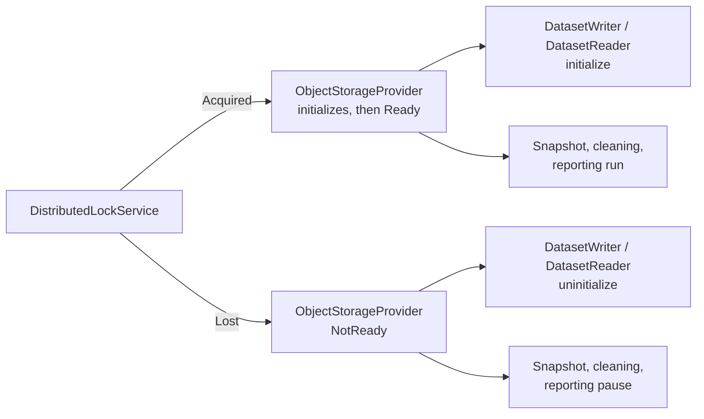
```mermaid
flowchart LR
    L[DistributedLockService] -- "Acquired" --> P[ObjectStorageProvider<br/>initializes, then Ready]
    L -- "Lost" --> N[ObjectStorageProvider<br/>NotReady]
    P --> W[DatasetWriter / DatasetReader<br/>initialize]
    P --> B[Snapshot, cleaning,<br/>reporting run]
    N --> WU[DatasetWriter / DatasetReader<br/>uninitialize]
    N --> BU[Snapshot, cleaning,<br/>reporting pause]
```

- On the holder, the provider loads the versions and reports Ready. The writer and the reader then load the index, and
  snapshot creation, cleaning and the reporting plugins run.
- On every other instance of a read/write host (a *standby*) the provider stays NotReady. **A standby serves neither
  writes nor reads** and its readiness check fails; it only waits for the lock. Read-only hosts
  (`AddReadOnlyDtoServer`) don't take part in the lock and serve reads all the time.
- `ObjectStorageProvider` also refuses a write when its `HasLock` flag is false. That flag is local: it can still be
  true for a moment after another instance took the lock over (see [the stalled holder](#7-the-holder-stalls-past-its-expiry)).
  The [fenced delta commit](#fenced-delta-commit) is what makes that moment harmless.

## Files

Both live in the dataset's folder (`CustomRootFolder` + DTO folder):

| File | Content | Written |
|---|---|---|
| `lock-file` | `{token}\n{expiry, ISO 8601}` | Only with compare-and-swap: create-only, or replace the exact version (GCS generation, ETag, content hash) that was read |
| `request-lock` | The instance id of the instance that asks for the lock | Plainly (last writer wins); it is a hint, not a lock |

A lock whose expiry has passed is free. Releasing the lock writes an expired lock (expiry `DateTimeOffset.MinValue`)
over our own version, so no conditional delete is needed.

The lock needs storage with compare-and-swap (`IConditionalDiskStorage`; every built-in provider has it). With other
storage, `DistributedLockService` fails at construction.

## Timings

`DistributedLock` configuration section (`DistributedLockOptions`), with the defaults:

| Setting | Default | Meaning |
|---|---|---|
| `PollingInterval` | 5 s | Every instance runs its loop this often: acquire, check `request-lock`, renew |
| `RenewalInterval` | 5 min | A lock is written with expiry = now + this |
| `RenewalThreshold` | 30 s | The holder renews once `RenewalInterval - RenewalThreshold` (4 min 30 s) passed since its last renewal |
| `HandoverTimeout` | 15 s | How long a holder that yielded waits for the requester before it competes for the lock again. Must be greater than `PollingInterval` |

What follows from them:

| | Default |
|---|---|
| Lock passed on during a deployment (handover) | ≤ 1 poll for the holder to yield + ≤ 1 poll for the requester to acquire: **≤ 10 s**, then initialization |
| Holder stops gracefully, a standby takes over | ≤ 1 poll: **≤ 5 s**, then initialization |
| Holder crashes, a standby takes over | When the lock expires: 25 s to 5 min after the crash, + ≤ 1 poll |
| Holder can't reach storage, gives up the lock itself | When its expiry is less than one poll away |

Expiry is compared with each instance's own clock. Keep clocks synchronized (NTP): a standby whose clock runs ahead by
more than `RenewalThreshold` can take an expired-looking lock just before the holder renews it.

## States

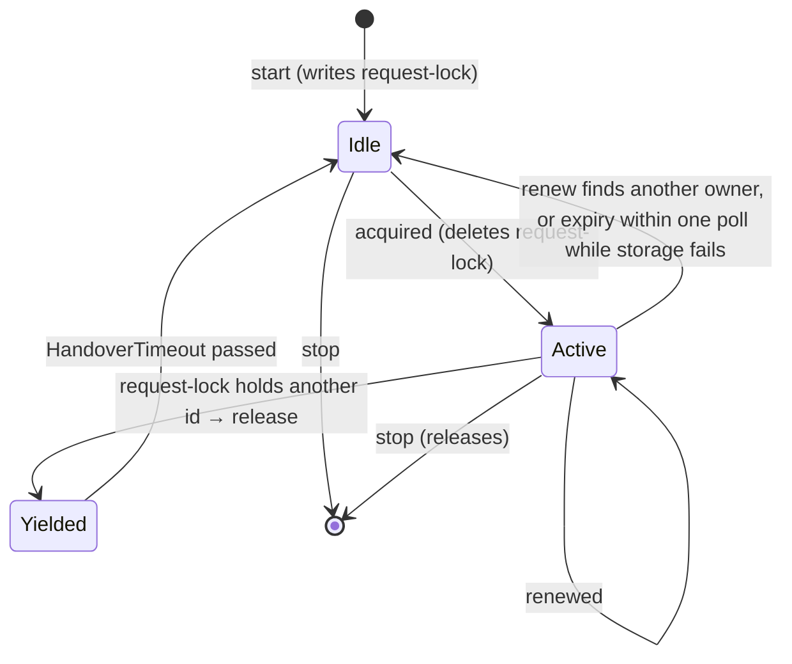
```mermaid
stateDiagram-v2
    [*] --> Idle: start (writes request-lock)
    Idle --> Active: acquired (deletes request-lock)
    Active --> Active: renewed
    Active --> Yielded: request-lock holds another id → release
    Yielded --> Idle: HandoverTimeout passed
    Active --> Idle: renew finds another owner, or expiry within one poll while storage fails
    Idle --> [*]: stop
    Active --> [*]: stop (releases)
```

`Idle` instances try to acquire on every poll. A `Yielded` instance doesn't, until `HandoverTimeout` has passed. Every
transition into and out of `Active` sends a `DistributedLockNotification` (`Acquried` or `Lost`), except a release on stop.

## Scenarios

The timelines use the defaults. `A` and `B` (and `C`) are instances of the same read/write host. `S` is the storage. In
lock contents, `A@10:05` means token of A, expiring at 10:05; `v1`, `v2` are the storage versions of the lock file.

### 1. First start

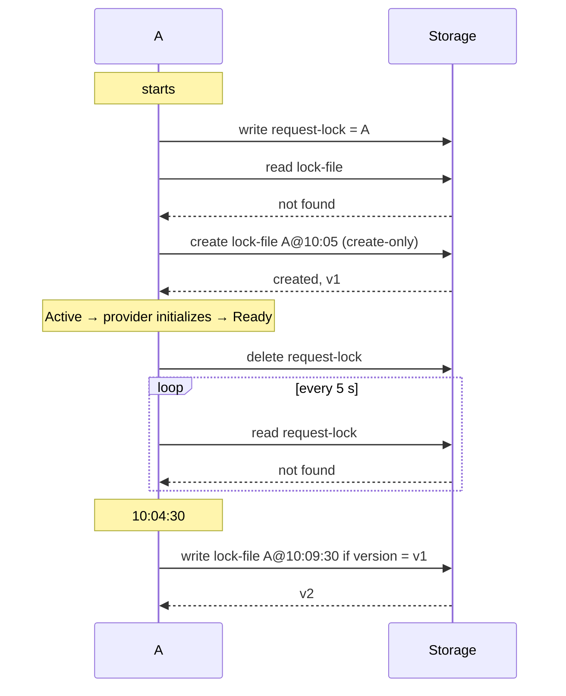
```mermaid
sequenceDiagram
    participant A
    participant S as Storage
    Note over A: starts
    A->>S: write request-lock = A
    A->>S: read lock-file
    S-->>A: not found
    A->>S: create lock-file A@10:05 (create-only)
    S-->>A: created, v1
    Note over A: Active → provider initializes → Ready
    A->>S: delete request-lock
    loop every 5 s
        A->>S: read request-lock
        S-->>A: not found
    end
    Note over A: 10:04:30
    A->>S: write lock-file A@10:09:30 if version = v1
    S-->>A: v2
```

### 2. Rolling deployment: a new instance asks for the lock

The newest instance is meant to run the dataset, so a starting instance asks the holder to hand over.

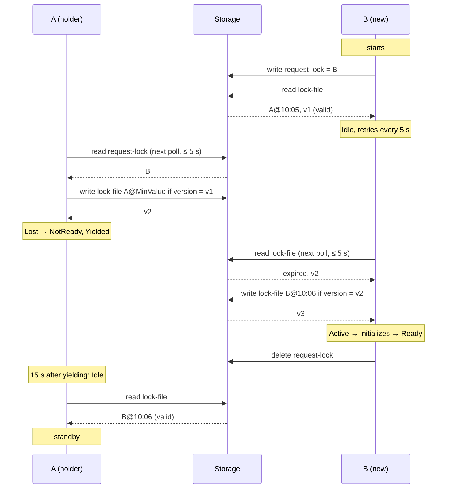
```mermaid
sequenceDiagram
    participant A as A (holder)
    participant S as Storage
    participant B as B (new)
    Note over B: starts
    B->>S: write request-lock = B
    B->>S: read lock-file
    S-->>B: A@10:05, v1 (valid)
    Note over B: Idle, retries every 5 s
    A->>S: read request-lock (next poll, ≤ 5 s)
    S-->>A: B
    A->>S: write lock-file A@MinValue if version = v1
    S-->>A: v2
    Note over A: Lost → NotReady, Yielded
    B->>S: read lock-file (next poll, ≤ 5 s)
    S-->>B: expired, v2
    B->>S: write lock-file B@10:06 if version = v2
    S-->>B: v3
    Note over B: Active → initializes → Ready
    B->>S: delete request-lock
    Note over A: 15 s after yielding: Idle
    A->>S: read lock-file
    S-->>A: B@10:06 (valid)
    Note over A: standby
```

Writes fail between A's yield and B's Ready: up to two polls plus B's initialization. Clients should retry.

### 3. Handover to a requester that dies

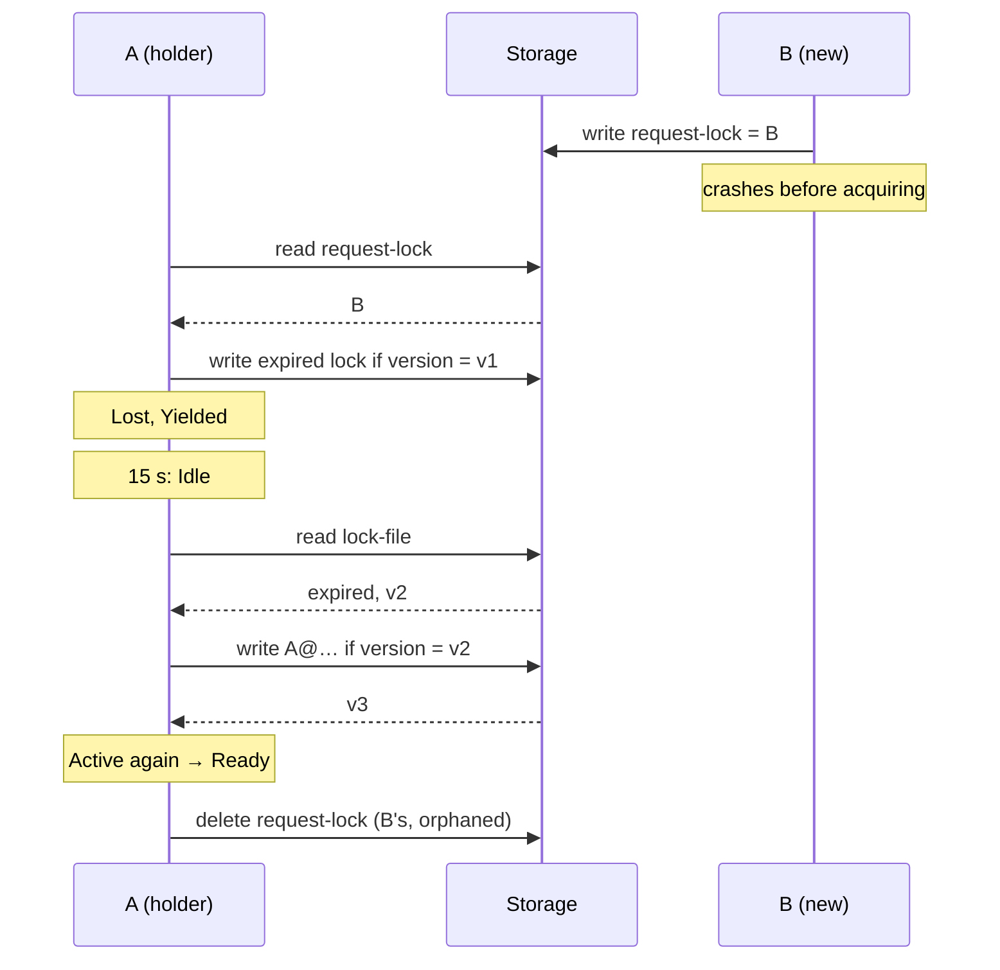
```mermaid
sequenceDiagram
    participant A as A (holder)
    participant S as Storage
    participant B as B (new)
    B->>S: write request-lock = B
    Note over B: crashes before acquiring
    A->>S: read request-lock
    S-->>A: B
    A->>S: write expired lock if version = v1
    Note over A: Lost, Yielded
    Note over A: 15 s: Idle
    A->>S: read lock-file
    S-->>A: expired, v2
    A->>S: write A@… if version = v2
    S-->>A: v3
    Note over A: Active again → Ready
    A->>S: delete request-lock (B's, orphaned)
```

The dataset is unavailable for about `HandoverTimeout` plus a poll plus initialization.

### 4. Three instances in a row

`request-lock` holds one id, the last one written. Each holder yields to whoever asked last.

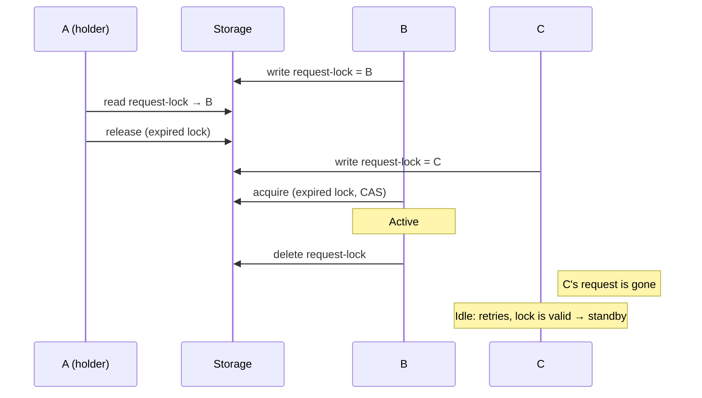
```mermaid
sequenceDiagram
    participant A as A (holder)
    participant S as Storage
    participant B
    participant C
    B->>S: write request-lock = B
    A->>S: read request-lock → B
    A->>S: release (expired lock)
    C->>S: write request-lock = C
    B->>S: acquire (expired lock, CAS)
    Note over B: Active
    B->>S: delete request-lock
    Note right of C: C's request is gone
    Note over C: Idle: retries, lock is valid → standby
```

Depending on the order, C's request is either deleted by B before B sees it (C stays standby, as above), or B sees
it and hands over to C as in scenario 2. Either way exactly one instance ends up as holder.

### 5. The holder stops gracefully

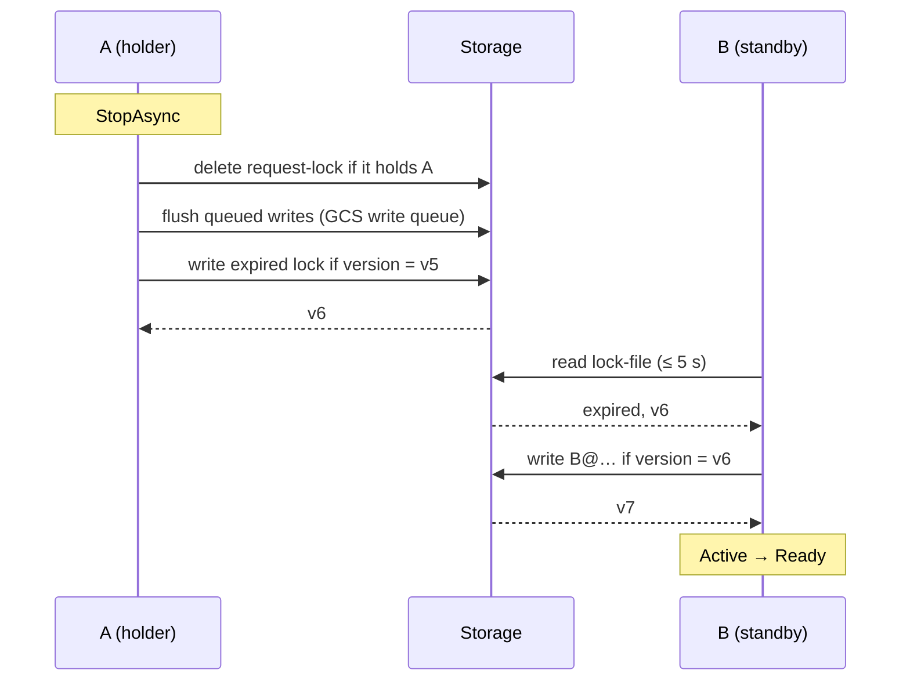
```mermaid
sequenceDiagram
    participant A as A (holder)
    participant S as Storage
    participant B as B (standby)
    Note over A: StopAsync
    A->>S: delete request-lock if it holds A
    A->>S: flush queued writes (GCS write queue)
    A->>S: write expired lock if version = v5
    S-->>A: v6
    B->>S: read lock-file (≤ 5 s)
    S-->>B: expired, v6
    B->>S: write B@… if version = v6
    S-->>B: v7
    Note over B: Active → Ready
```

### 6. The holder crashes

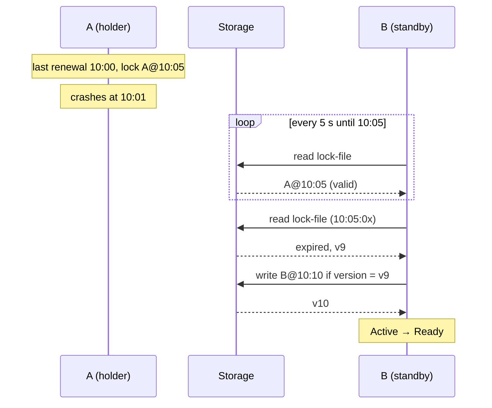
```mermaid
sequenceDiagram
    participant A as A (holder)
    participant S as Storage
    participant B as B (standby)
    Note over A: last renewal 10:00, lock A@10:05
    Note over A: crashes at 10:01
    loop every 5 s until 10:05
        B->>S: read lock-file
        S-->>B: A@10:05 (valid)
    end
    B->>S: read lock-file (10:05:0x)
    S-->>B: expired, v9
    B->>S: write B@10:10 if version = v9
    S-->>B: v10
    Note over B: Active → Ready
```

The dataset has no writer until the lock expires: between 25 s (crash just before a renewal) and 5 min (crash just
after one). Lower `RenewalInterval` to shorten that, at the cost of more lock writes.

### 7. The holder stalls past its expiry

A long GC pause, a frozen VM or a network partition: the holder doesn't run its loop, its lock expires and a standby
takes over. When the old holder resumes, it may still have a write in flight, and its `HasLock` flag is still true
until its next renewal attempt.

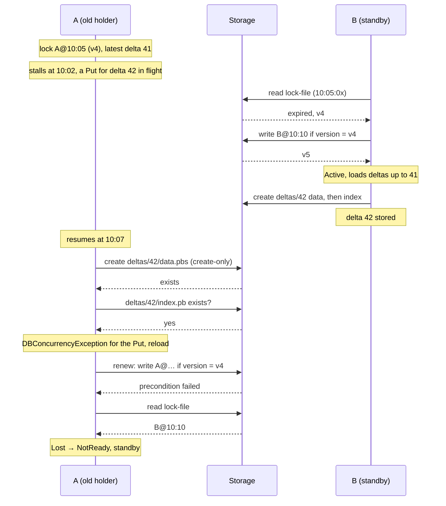
```mermaid
sequenceDiagram
    participant A as A (old holder)
    participant S as Storage
    participant B as B (standby)
    Note over A: lock A@10:05 (v4), latest delta 41
    Note over A: stalls at 10:02, a Put for delta 42 in flight
    B->>S: read lock-file (10:05:0x)
    S-->>B: expired, v4
    B->>S: write B@10:10 if version = v4
    S-->>B: v5
    Note over B: Active, loads deltas up to 41
    B->>S: create deltas/42 data, then index
    Note over B: delta 42 stored
    Note over A: resumes at 10:07
    A->>S: create deltas/42/data.pbs (create-only)
    S-->>A: exists
    A->>S: deltas/42/index.pb exists?
    S-->>A: yes
    Note over A: DBConcurrencyException for the Put, reload
    A->>S: renew: write A@… if version = v4
    S-->>A: precondition failed
    A->>S: read lock-file
    S-->>A: B@10:10
    Note over A: Lost → NotReady, standby
```

Without the fenced commit, A's delta 42 would have overwritten B's. The client of A's Put gets an error and retries
against the new holder.

### 8. Two standbys race for an expired lock

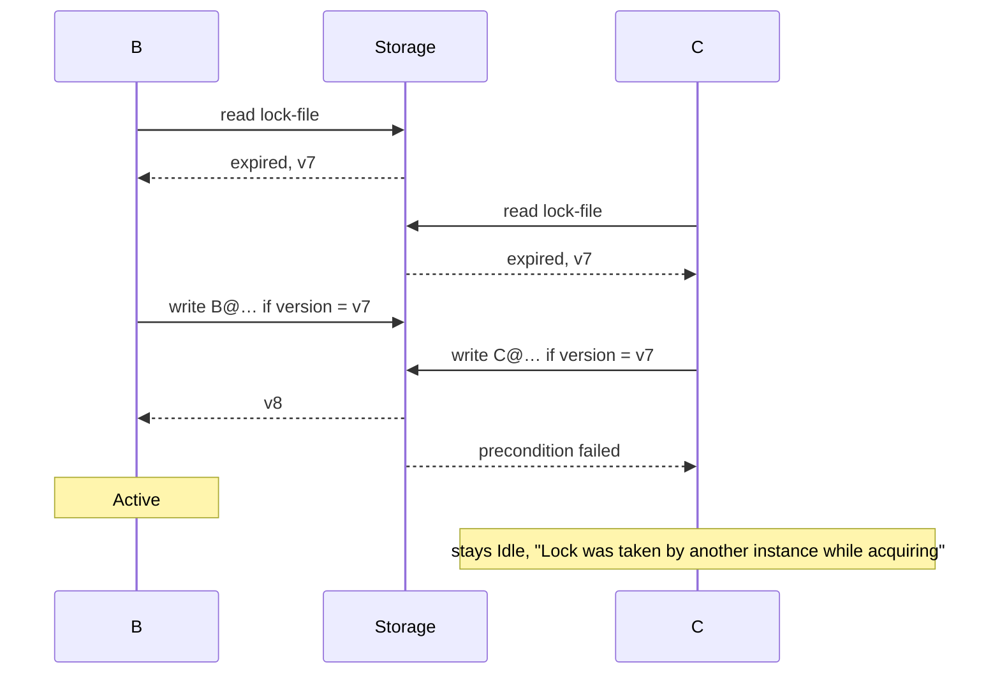
```mermaid
sequenceDiagram
    participant B
    participant S as Storage
    participant C
    B->>S: read lock-file
    S-->>B: expired, v7
    C->>S: read lock-file
    S-->>C: expired, v7
    B->>S: write B@… if version = v7
    C->>S: write C@… if version = v7
    S-->>B: v8
    S-->>C: precondition failed
    Note over B: Active
    Note over C: stays Idle, "Lock was taken by another instance while acquiring"
```

Before compare-and-swap both would have become Active.

### 9. A renewal lands but its response is lost

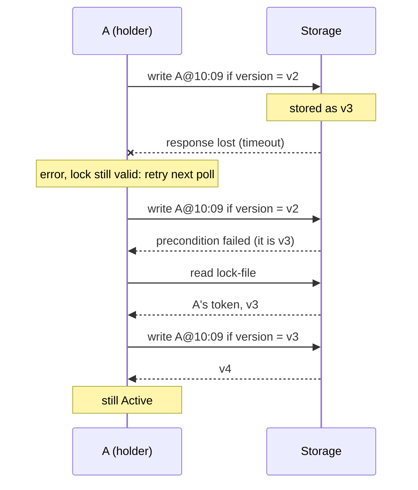
```mermaid
sequenceDiagram
    participant A as A (holder)
    participant S as Storage
    A->>S: write A@10:09 if version = v2
    Note over S: stored as v3
    S--xA: response lost (timeout)
    Note over A: error, lock still valid: retry next poll
    A->>S: write A@10:09 if version = v2
    S-->>A: precondition failed (it is v3)
    A->>S: read lock-file
    S-->>A: A's token, v3
    A->>S: write A@10:09 if version = v3
    S-->>A: v4
    Note over A: still Active
```

Only A writes A's token, so finding its own token means the earlier write landed.

### 10. Storage is unreachable

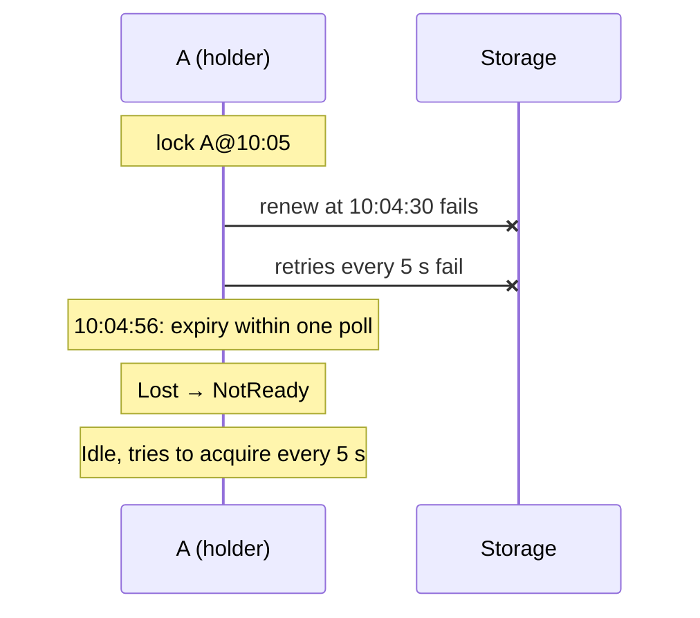
```mermaid
sequenceDiagram
    participant A as A (holder)
    participant S as Storage
    Note over A: lock A@10:05
    A-xS: renew at 10:04:30 fails
    A-xS: retries every 5 s fail
    Note over A: 10:04:56: expiry within one poll
    Note over A: Lost → NotReady
    Note over A: Idle, tries to acquire every 5 s
```

A gives up its lock before it expires, so no other instance can take over while A still thinks it's the holder. All
instances need storage to acquire; the first one to reach it after the expiry takes the lock.

### 11. Two writers without the lock

Two hosts that write the same dataset without `WithDistributedLock()` (or a deployment that runs two by mistake).
Neither knows the other's deltas until it collides with them.

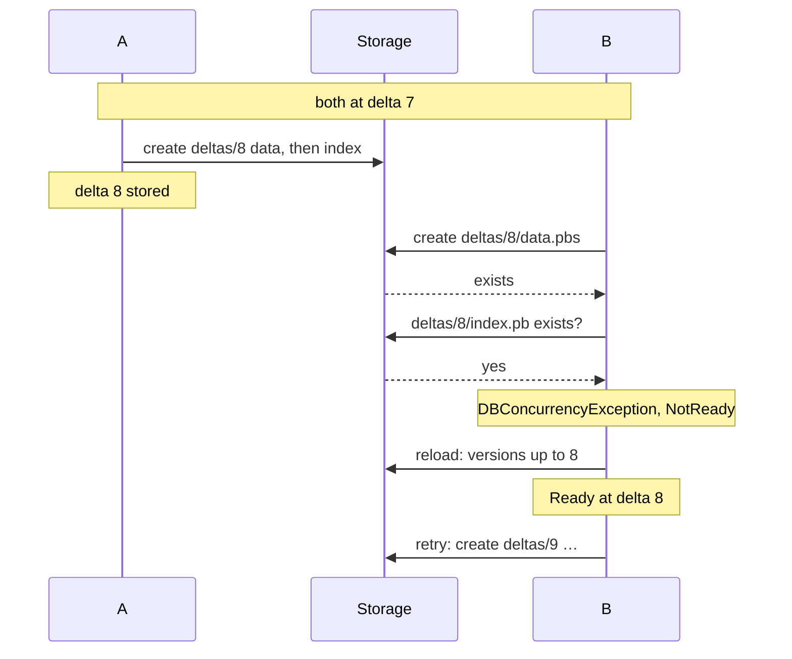
```mermaid
sequenceDiagram
    participant A
    participant S as Storage
    participant B
    Note over A,B: both at delta 7
    A->>S: create deltas/8 data, then index
    Note over A: delta 8 stored
    B->>S: create deltas/8/data.pbs
    S-->>B: exists
    B->>S: deltas/8/index.pb exists?
    S-->>B: yes
    Note over B: DBConcurrencyException, NotReady
    B->>S: reload: versions up to 8
    Note over B: Ready at delta 8
    B->>S: retry: create deltas/9 …
```

Nothing is overwritten, but every collision costs the loser a failed write and a reload. Routing a dataset's writes to
one instance (the lock) avoids that.

### 12. A writer behind cleaning

A writer that stalled for long enough that a snapshot and cleaning (without `KeepAllDeltas`) removed the deltas
around its next version.

```mermaid
sequenceDiagram
    participant A as A (stale, at 41)
    participant S as Storage
    Note over S: snapshot 60; deltas ≤ 60 removed
    A->>S: create deltas/42/data.pbs
    S-->>A: created (the folder was removed)
    A->>S: deltas/41/index.pb or snapshots/41/index.pb exists?
    S-->>A: neither
    A->>S: delete deltas/42/data.pbs
    Note over A: DBConcurrencyException, reload
```

Without this check A would store delta 42 below the oldest delta: a write reported as stored that nobody reads, and a
`DeltaInfo.pb` pointing back to 42.

### 13. A writer crashes between data and index

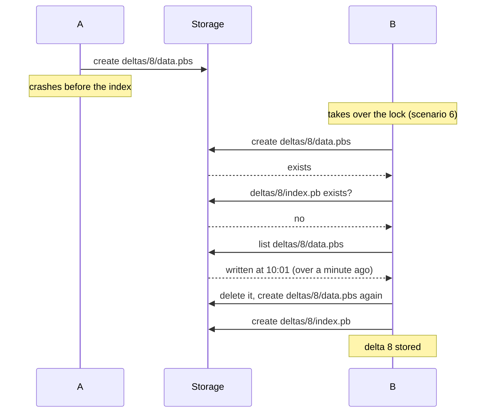
```mermaid
sequenceDiagram
    participant A
    participant S as Storage
    participant B
    A->>S: create deltas/8/data.pbs
    Note over A: crashes before the index
    Note over B: takes over the lock (scenario 6)
    B->>S: create deltas/8/data.pbs
    S-->>B: exists
    B->>S: deltas/8/index.pb exists?
    S-->>B: no
    B->>S: list deltas/8/data.pbs
    S-->>B: written at 10:01 (over a minute ago)
    B->>S: delete it, create deltas/8/data.pbs again
    B->>S: create deltas/8/index.pb
    Note over B: delta 8 stored
```

Data without an index that is younger than a minute is a conflict instead: it may belong to a writer that is about to
write its index. That conflict doesn't reload the dataset (the writer isn't behind), so reads go on. After a crash the
lock takes longer than a minute to pass on, so a new holder normally finds the data old enough.

The age compares this host's clock with the storage's timestamp of the file: a host whose clock runs ahead of the
storage by more than a minute can take data that another writer just created for left over.

The version listing (used when `DeltaInfo.pb` is missing or broken) also counts a delta only by its `index.pb`, so data
left by a crash doesn't stop a host from starting.

## Fenced delta commit

On storage with compare-and-swap, `ObjectStorageProvider.StoreDelta` stores delta N as:

1. In parallel: create `deltas/N/data.pbs` only if absent (deltas of only deletes have none), and check that
   `deltas/N-1/index.pb` or `snapshots/N-1/index.pb` exists.
2. Create `deltas/N/index.pb` only if absent. **This is the commit**: readers find deltas by their index, also past
   `DeltaInfo.pb`.
3. Write `DeltaInfo.pb`. It is a hint; if this write fails, the delta is still stored and the write succeeds.

Any failed precondition throws `System.Data.DBConcurrencyException`. When the writer is behind (the index exists, or
the previous version is gone) the provider then reports NotReady and, unless the lock is lost, initializes again and
reports Ready, so the writer and reader reload from storage. The write that failed is not stored; the caller should
retry it.

A create whose response got lost (the SDK retries a request that had landed, and the retry finds the object) is not a
conflict: an index that holds exactly our bytes is ours. The lock does the same for an acquire: a lock file holding the
token it tried to write is its lock.

### What is and isn't guaranteed

- At any time, `lock-file` names at most one valid holder. An instance's own `HasLock` flag can lag behind it (scenario 7).
- A stored delta is never overwritten, and a delta below the oldest one isn't re-created, whoever writes.
- The remaining gap: a writer that pauses for more than a minute between creating its data and its index, and then
  resumes exactly while the next writer replaces that data (scenario 13), can store its index over the other's data.
  Closing it needs a per-attempt data name referenced from the index, which is a change to the disk format.
- Only deltas are fenced. A holder whose lock expired unnoticed can still write a snapshot, `SnapshotInfo.pb`,
  `ProcessedVersions.pb` or clean, until it notices (scenario 7).
- Minio: `minio-dotnet` uploads objects of 5 MiB or more in parts and drops the condition, so for delta data that size
  the create is check-then-write. Two writers creating the same version's large data at the same moment can both
  succeed; the index still decides, but may then point into the other's data.
- Queued `DeltaInfo.pb` writes of an instance that yielded may land after the new holder's. Readers then see an older
  `latest_delta_version`, and find the newer deltas by their index.

## One lock for all datasets of an instance

With a lock per dataset, every dataset of a server is passed on separately: during a deployment some datasets are
written by the old instance and some by the new one, and a server with many datasets runs a lock loop, a `lock-file`
and its renewals per dataset. `WithSharedDistributedLock()` puts all datasets of an instance under one lock instead:

```csharp
// Before the datasets, so a host that stops its services one after the other stops it after them
services.AddSharedDistributedLock<GoogleCloudStorage<SharedDistributedLock>>("MyServerLock");

services.AddDtoServer<Link>().WithGoogleCloudStorage().WithSharedDistributedLock().Build();
services.AddDtoServer<Label>().WithGoogleCloudStorage().WithSharedDistributedLock().Build();
```

- `SharedDistributedLock` is a `DistributedLockService` with its files in `{CustomRootFolder}{lockFolder}/`, on a
  storage of its own: an `IConditionalDiskStorage<SharedDistributedLock>`, so only a storage with compare-and-swap
  writes compiles in, and the lock never falls back to read-then-write. That storage is a singleton of the service
  collection the lock is registered in, which owns and disposes it; no dataset's storage is used. It reads the
  storage's section (`GoogleCloud` here) and the `Storage` section's `CustomRootFolder`, so it must reach the same
  bucket and root as the datasets. No health check watches that storage by default: one that can't reach the bucket
  only shows as every dataset waiting for the lock. It is also registered as `IDiskStorage<SharedDistributedLock>`,
  so the provider's check can watch it:
  `services.AddHealthChecks().AddCheck<GoogleCloudHealthCheck<SharedDistributedLock>>("storage.googlecloud.SharedLock")`.
- Each dataset's `IDistributedLock<T>` is a `SharedDistributedLockMember<T>`: it has the lock when the instance has it,
  and passes every Acquired and Lost on to the dataset's notifications hub. A dataset that starts later gets the
  current state on joining.
- Everything in the scenarios above holds for the instance as a whole: one `request-lock` asks for all datasets, one
  renewal keeps them, and a takeover moves them all.
- The lock starts when the first dataset joins. On stop it waits until every dataset has stopped, which flushes the
  dataset's storage and leaves, and only then releases the lock, so the next holder sees all their writes. A dataset
  that has left no longer has the lock, so it refuses writes its flush would miss.
- A host that stops its services one after the other (the default) stops them in reverse order of registration:
  register the lock before the services that start and stop the datasets. Registered after them, it is stopped first
  and waits for datasets the host stops only after it, so every shutdown hangs until the host's shutdown timeout and
  then releases before they flushed. With `HostOptions.ServicesStopConcurrently` the order doesn't matter.
- When the stop token fires first (the host's shutdown timeout), it logs a warning and releases anyway. A dataset that
  joins once the lock is stopping gets no state.
- `lockFolder` names the server: instances that share it hand over to each other, so give every kind of server its own.

A host that builds a service collection per dataset registers the lock, and with it the lock's storage, in its root,
and adds that instance to every dataset's collection. The root owns both: removing or replacing a dataset disposes
only that dataset's own storage, and the lock keeps running until the root stops it.

```csharp
// Root: the storage settings the datasets get (sections, and a PostConfigure<StorageConfig> they have), then the lock,
// before the service that starts and stops the datasets unless the host stops its services concurrently
root.AddValidatedConfigSection<GoogleCloudConfig>();
root.AddSharedDistributedLock<GoogleCloudStorage<SharedDistributedLock>>("MyServerLock");

// Per dataset: the root's instance, so this collection neither starts, stops nor disposes it
services.AddSingleton(rootProvider.GetRequiredService<SharedDistributedLock>());
services.AddDtoServer<T>().WithGoogleCloudStorage().WithSharedDistributedLock().Build();
```

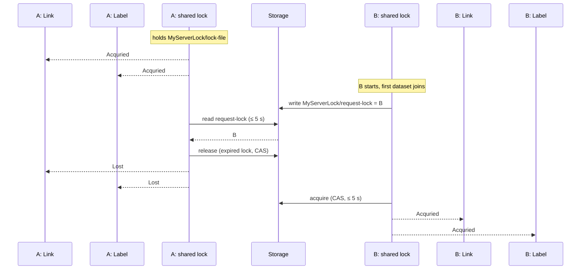
```mermaid
sequenceDiagram
    participant A1 as A: Link
    participant A2 as A: Label
    participant LA as A: shared lock
    participant S as Storage
    participant LB as B: shared lock
    participant B1 as B: Link
    participant B2 as B: Label
    Note over LA: holds MyServerLock/lock-file
    LA-->>A1: Acquried
    LA-->>A2: Acquried
    Note over LB: B starts, first dataset joins
    LB->>S: write MyServerLock/request-lock = B
    LA->>S: read request-lock (≤ 5 s)
    S-->>LA: B
    LA->>S: release (expired lock, CAS)
    LA-->>A1: Lost
    LA-->>A2: Lost
    LB->>S: acquire (CAS, ≤ 5 s)
    LB-->>B1: Acquried
    LB-->>B2: Acquried
```
